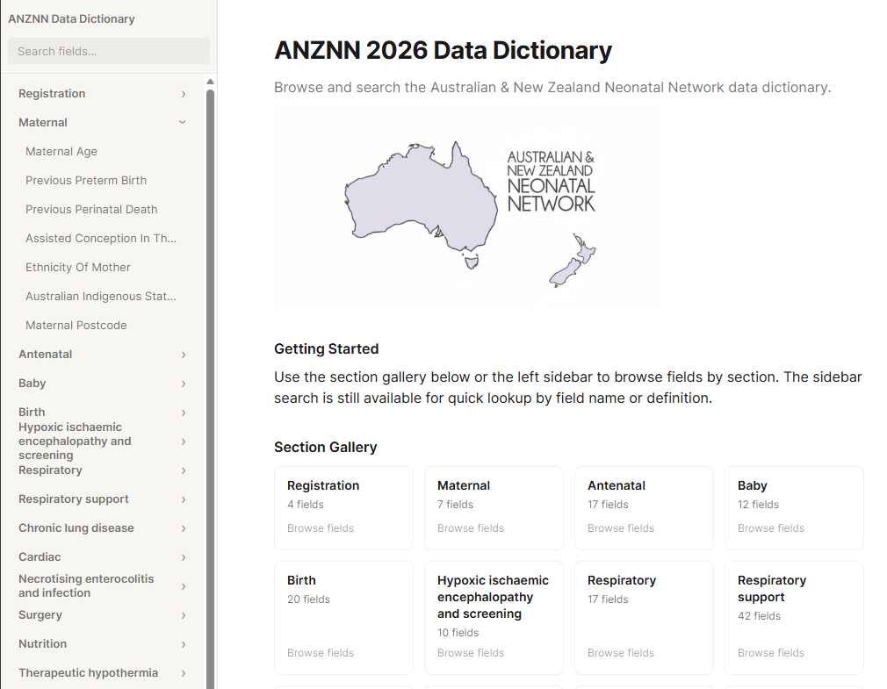
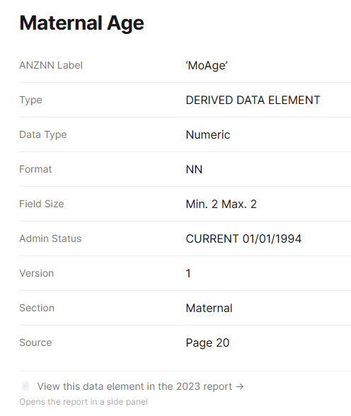
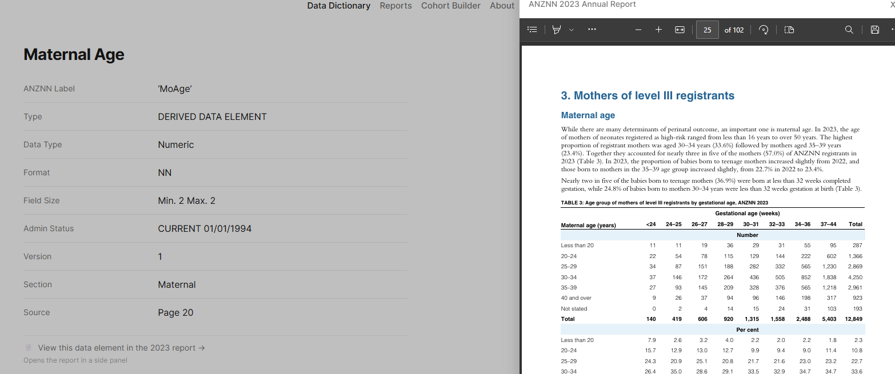

# Interactive Data Dictionary + Cohort Builder UI (Prototype)


**Live Prototype**: [View it here](https://data-dictionary-site.kuznetsov-rar.workers.dev/)

### Project Description

This project explores more usable interfaces for working with clinical data.

In many organisations, data dictionaries live in static PDFs or Word documents. They’re hard to search, slow to navigate, and disconnected from how data is actually used in reports and analysis. This project includes a web-first, interactive data dictionary for exploration, plus a fast UI prototype for a cohort builder workflow.

The interface is inspired by Notion-style documentation, with an emphasis on clean typography, generous spacing, and multiple navigation paths. Users can browse fields by section, search directly, or move between dictionary definitions in sidebar. The goal of this project is to reduce cognitive load in navigation patterns inspired by modern documentation tools like Notion.

The dictionary experience is delivered as a fully working prototype (no login required) and is intended for data stewards, analysts, and hiring managers who need to understand complex datasets quickly. All dictionary content was programmatically extracted from an official ANZNN data dictionary source and transformed into a structured, navigable web experience.

<p align="left">     </p>

- **Python**: parses the official ANZNN data dictionary into structured data.
- **React + Vite**: delivers the interactive, searchable web prototype.
- **JavaScript**: handles UI behavior and dictionary-to-report navigation.

### Feature Scope

The project currently includes two UI surfaces:

- **Interactive Data Dictionary (functional prototype)**: users can search and browse fields, open field-level definitions/context, navigate section structure, and jump to linked report pages.
- **Cohort Builder (UI-only fast prototype)**: users can compose inclusion/exclusion criteria with groups and operators, browse concept domains, and run through save/success screens. Counts and outputs are placeholders and there is no BI/backend execution yet.

### UI Demonstration





In the data dictionary UI, when a user clicks the report-link control for a data element, the app connects that element to relevant report pages for quick downstream context.



### Repo Map

```text
data-dictionary-site/
├─ extract.py                        # Parse ANZNN 2026 PDF -> structured JSON + MDX
├─ link_report.py                    # Build field_id -> 2023 report page links
├─ ANZNN_2026_Data_Dictionary.pdf    # Source data dictionary
├─ Report ... 2023 ... .pdf          # Source annual report for cross-linking
├─ content/                          # Generated field docs (.mdx, ~245 files)
├─ data/
│  ├─ fields.json                    # Field metadata used by the app
│  └─ sections.json                  # Section/appendix navigation model
├─ assets/                           # Logos and static project images
└─ site/                             # React + Vite frontend
   ├─ package.json                   # Frontend scripts and dependencies
   ├─ public/
   │  └─ report_links.json           # Generated report cross-links
   └─ src/
      ├─ App.jsx                     # App shell, routes, sidebar logic
      ├─ HomePage.jsx / FieldPage.jsx / SectionGalleryPage.jsx / ReportsPage.jsx
      ├─ CohortBuilderPage.jsx       # Cohort builder route/page (UI prototype)
      ├─ cohort-builder/             # Cohort builder UI components + controls/
      ├─ main.jsx                    # React bootstrap
      ├─ index.css / cohort-builder.css
      └─ fieldDirectoryUtils.js
